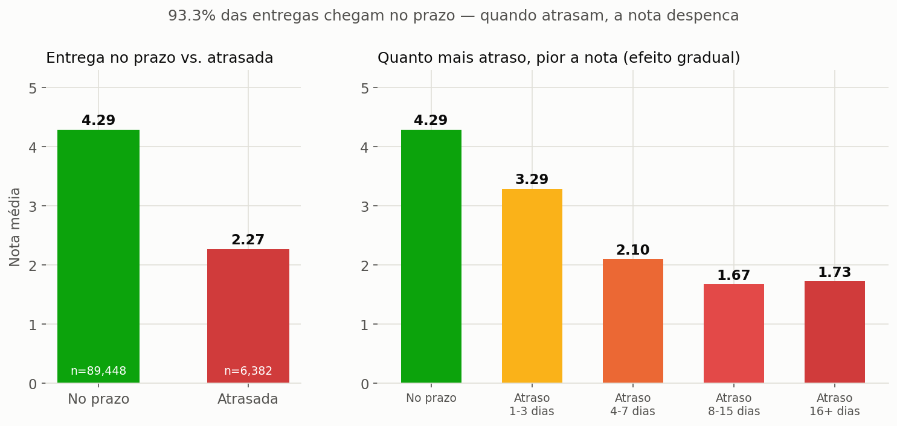

# 😊 Felicidade do Cliente — Olist

Análise de dados + dashboard interativo sobre o que realmente move a satisfação do
cliente em um e-commerce brasileiro: prazo de entrega, categoria de produto, região,
forma de pagamento — e o que os clientes insatisfeitos dizem com as próprias palavras.

**Base de dados:** [Brazilian E-Commerce Public Dataset by Olist](https://www.kaggle.com/datasets/olistbr/brazilian-ecommerce) (Kaggle) — ~100 mil pedidos entre set/2016 e ago/2018.

---

## 🔑 Principais achados

1. **Prazo de entrega é, disparado, o maior driver de satisfação.** Nota média cai de **4,29** (entrega no prazo) para **2,27** (atrasada) — e o efeito é gradual, piorando a cada faixa adicional de atraso. Só 6,7% dos pedidos atrasam, mas o impacto por pedido é enorme.
2. **O texto dos clientes confirma o número:** as palavras mais citadas por Detratores são sobre entrega (*recebi, entrega, chegou, prazo, aguardando*), não sobre o produto.
3. **Móveis de escritório** é a categoria com pior nota entre as com volume relevante (3,62); livros e alimentos ficam no topo (~4,4+).
4. **Região importa, provavelmente pelo mesmo mecanismo:** os piores estados (RR, AL, MA) são os mais distantes dos centros de distribuição.
5. A janela da **Black Friday (nov/2017–mar/2018)** mostra o pior trecho da série temporal — consistente com sobrecarga operacional afetando entrega.

📓 Análise completa, com o raciocínio por trás de cada achado: [`notebooks/analise_exploratoria.ipynb`](notebooks/analise_exploratoria.ipynb).

<p align="center">
  
</p>

---

## 📊 Dashboard interativo

`dashboard/app.py` (Streamlit) deixa explorar os mesmos dados com filtros ao vivo por
período, estado, categoria e faixa de satisfação:

- **📊 Panorama** — KPIs gerais e distribuição das notas
- **🚚 Entrega** — o driver mais forte, com o efeito gradual do atraso
- **📦 Produto & Região** — piores/melhores categorias e estados
- **💳 Pagamento & Tendência** — forma de pagamento, parcelamento e evolução mensal
- **💬 Vozes do cliente** — palavras mais citadas pelos Detratores (reativo aos filtros) + amostra de comentários reais

```bash
pip install -r requirements.txt
python src/etl_pipeline.py        # gera data/processed/ a partir dos dados brutos
streamlit run dashboard/app.py
```

---

## 🧱 Modelagem dos dados

`src/etl_pipeline.py` lê os 9 CSVs brutos da Olist e monta um esquema estrela em
`data/processed/`: 5 dimensões (`dim_clientes`, `dim_produtos`, `dim_vendedores`,
`dim_geolocalizacao`, `dim_tempo`) + 2 fatos:

- **`fato_pedidos`** — grão de **1 linha por pedido avaliado** (~98,7 mil linhas). É a base de tudo neste projeto.
- **`fato_itens_pedido`** — grão de 1 linha por item do pedido, para análises de categoria/vendedor que precisam desse nível de detalhe.

Duas decisões de modelagem valem menção, porque mudam os números:

- **Correção de fan-out:** uma primeira versão deste pipeline cruzava reviews com
  itens do pedido usando só `order_id`. Pedidos com mais de um item duplicavam a
  linha da review — o arquivo final tinha 48.166 linhas para 40.668 avaliações
  únicas. A versão atual agrega itens e pagamentos ao grão "1 por pedido" antes do
  join final, e tem um `assert` no próprio script garantindo que isso não volte a
  acontecer.
- **Amostra maior:** a primeira versão usava só avaliações com comentário de texto
  (~41 mil). `fato_pedidos` usa todas as avaliações com nota, texto ou não
  (~98,7 mil) — o texto continua disponível para quem quiser fazer mineração dele.

---

## 📁 Estrutura do projeto

```
├── data/
│   ├── raw/              # CSVs originais da Olist (não versionados - ver "Como rodar")
│   └── processed/        # esquema estrela gerado pelo ETL (não versionado)
├── src/
│   ├── etl_pipeline.py   # ETL: raw -> esquema estrela
│   ├── viz_theme.py      # paleta e estilo compartilhados (notebook + dashboard)
│   └── text_utils.py     # limpeza/tokenização de texto compartilhada
├── notebooks/
│   └── analise_exploratoria.ipynb
├── dashboard/
│   └── app.py            # dashboard Streamlit
├── assets/img/           # gráficos exportados (usados neste README e no post)
└── requirements.txt
```

## ▶️ Como rodar do zero

1. Baixe o [dataset no Kaggle](https://www.kaggle.com/datasets/olistbr/brazilian-ecommerce) e extraia os 9 CSVs em `data/raw/`.
2. `pip install -r requirements.txt`
3. `python src/etl_pipeline.py` — gera `data/processed/`.
4. `streamlit run dashboard/app.py` — abre o dashboard, ou abra `notebooks/analise_exploratoria.ipynb` para a análise completa.

## 🛠️ Stack

Python · pandas · numpy · matplotlib/seaborn (notebook) · Plotly (dashboard) · Streamlit

## 📌 Próximos passos

Versão do dashboard em **Power BI** sobre o mesmo esquema estrela, como segunda
peça do portfólio.

## 📄 Dados

[Brazilian E-Commerce Public Dataset by Olist](https://www.kaggle.com/datasets/olistbr/brazilian-ecommerce),
disponibilizado publicamente no Kaggle sob licença CC BY-NC-SA 4.0.
